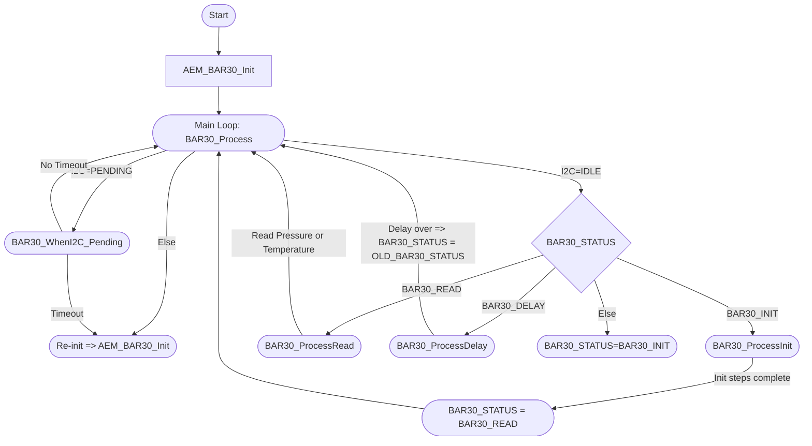

# Overview

This codebase provides a layered, state machine-driven solution for integrating the Blue Robotics BAR30 pressure sensor (based on the MS5837 chip) with an STM32 microcontroller using the HAL library. It comprises two main parts:

1. MS5837 Driver (`MS5837.c/.h`)
   - Handles low-level I2C communication with the sensor, including PROM reading, pressure/temperature conversion commands, and CRC checks.
   - Supports both 30BA and 02BA variants.
   - Uses non-blocking I2C functions (with interrupts and callbacks) to prevent the main loop from blocking.

2. AEM_BAR30 Layer (`AEM_BAR30.c/.h`)
   - Implements a high-level state machine that manages sensor initialization, calibration, and periodic pressure/temperature reading.
   - Alternates between D1 (pressure) and D2 (temperature) conversions automatically.
   - Calculates depth from pressure using the hydrostatic pressure formula.
   - Monitors I2C timeouts and automatically reinitializes the sensor if needed.

### State Machine Flow

- Initialization (`BAR30_INIT`)
  1. Reads PROM data and checks CRC.
  2. Initializes conversion sequence (D1/D2).
  3. Calculates initial pressure/temperature.
  4. Transitions to `BAR30_READ`.

- Reading (`BAR30_READ`)
  Alternates between:
  - D1 conversion → pressure read.
  - D2 conversion → temperature read.
  - Updates processed pressure, temperature, and depth data.

- Delay (`BAR30_DELAY`)
  Non-blocking delay between conversion and read steps.

- Error/Timeout Handling
  If the driver detects an I2C stall (BAR30_I2C_PENDING too long), the state machine triggers a re-initialization.

### Key Features

- **Non-blocking I2C**
  All I2C operations use interrupt/callback mechanisms (e.g., `HAL_I2C_Mem_Read_IT`), avoiding delay-based or polling designs.

- **Automatic Recovery**
  I2C timeouts are handled gracefully. If a sensor hangs or fails to respond, it is reset and reinitialized automatically.

- **Depth Calculation**
  Based on the hydrostatic pressure formula: Depth (cm) = (((Pressure * 100) - 101300) / (1029 * 9.80665)) * 100
  Pressure is given in mbar; conversion assumes freshwater density and sea-level reference.

With this structure, application code only needs to:
1. Call `AEM_BAR30_Init()` once at startup.
2. Call `BAR30_Process()` periodically in the main loop.
3. Access data via `BAR30.ProcessedPressure`, `BAR30.ProcessedTemperature`, and `BAR30.CalculatedDepth`.

This state machine design ensures modular and non-blocking sensor integration.

# Flowcharts

## AEM_BAR30.c/.h



# Usage
1. **Add the Source Files**  
   Copy `MS5837.c/.h` and `AEM_BAR30.c/.h` into your STM32 project’s source and header directories (e.g., `Core/Src` and `Core/Inc`).

2. **Include the Headers**  
   In your `main.c` or equivalent file:
   ```c
   #include "MS5837.h"
   #include "AEM_BAR30.h"
   ```

3. **Add functions like this**
    ```c
    int main(void)
	{
	    HAL_Init();
	    SystemClock_Config();
	    MX_GPIO_Init();
	    MX_I2C2_Init(); // Ensure this matches the I2C port used for BAR30

	    AEM_BAR30_Init(); // Initializes the driver and sets status to INIT

	    while (1)
	    {
	        // Periodically call BAR30_Process() in the main loop
	        BAR30_Process();

	        // Once initialized (BAR30_STATUS == BAR30_READ),
	        // the driver will alternate between D1/D2 reads.
	        // Access values via BAR30.ProcessedPressure, ProcessedTemperature, CalculatedDepth
	    }
	}
    ```

    # Acknowledgments

Special thanks to everyone who contributed insights, testing, and support for this driver and firmware layer.  
- **Blue Robotics** for providing comprehensive documentation on the BNO055 sensor.  
- **STM32 Community** for ongoing discussions and code examples on HAL-based I2C usage.  
- **IEEE YTU Student Branch** for conceptual ideas, code testing, and moral support.

I would also like to express my heartfelt gratitude to **Mustafa Budak** for unwavering support and encouragement throughout this project.

Your feedback, issues, and pull requests help improve this project continuously. Thanks for being part of it!

# Contact

If you have any questions, suggestions, or feedback regarding this project, feel free to reach out:

- **Email**: [mercanalieren@gmail.com](mailto:mercanalieren@gmail.com)
- **Phone**: +90 (546) 401 12 38
- **GitHub Issues**: Please open an issue in this repository for bug reports or feature requests.

I’m always happy to hear from contributors and users!

# License

This code is licensed under the [MIT License](./LICENSE) © 2025 Ali Eren Mercan.